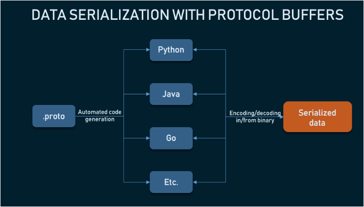
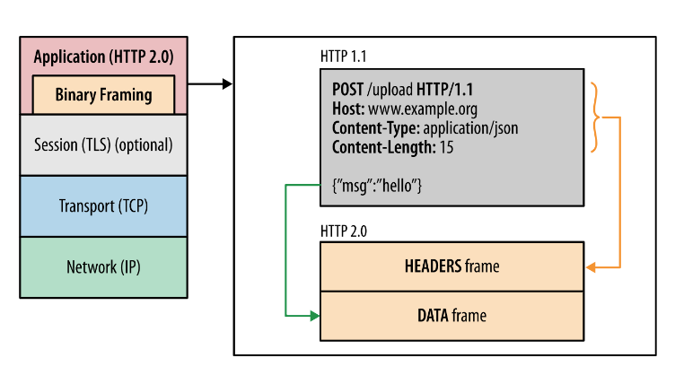

### What is gPCR

It is a robust _open-source_ RPC (Remote Procedure Call) framework used to build scalable and fast APIs.

gRPC owes its success to the employment of two techniques: using HTTP/2 instead of HTTP/1.1 and protocol buffers as an
alternative to XML and JSON. Most of the advantages of gRPC stem from using these technologies.

### Advantages

#### 1. Performance

It offers up to 10x faster performance and API-security than REST+JSON communication as it uses **Protocol Buffers**
and **HTTP/2**

#### 2. Lightweight

Depending on the type of call, gRPC-specific messages can be up ro 30 percent smaller than JSON messages.

#### 3. More connection options/ streaming

While REST focuses on request-response architecture, gRPC provides support for data streaming with event-driven
architectures: server-side streaming, client-side streaming, and bidirectional streaming.

- Below are more advantages, simplified:
    - They are simpler
    - They are 3 to 10 times smaller
    - They are 20 to 100 times faster
    - They are less ambiguous
    - They generate data access classes that are easier to use programmatically

### Disadvantages

#### 1. Limited browser support

Since gRPC heavily relies on HTTP/2, one can't call a gRPC service from a web browser directly given no modern browsers
can access HTTP/2 frames. A proxy must therefore be used.

#### 2. Steeper learning curve

Compared to REST and GraphQL, which primarily use JSON, it takes a developer more time to get acquainted with protocol
buffers and find tools for dealing with HTTP/2 friction.

#### 3. Non human-readable format

By compressing data to a binary format, `protobuf` files become non-human readable, unlike XML and JSON. To then analyze
payloads, debug and write manual requests, developers have to use extra tools.

#### 4. Lack of maturity

With minimal developer support outside Google, as things stand, not many tools created for HTTP/2 and protocol buffers,
the community lacks information about best practices, workarounds and success stories.

### Protocol Buffers



1. In a `.proto` text file, a programmer defines a schema - how they want the data to be structured. They use numbers
   instead of field names to save storage.
2. Using a _protoc compiler_, this file is then automatically compiled into any of the numerous supported languages like
   C++, Python, Go and more.
3. At runtime, messages are compressed and serialized in binary format.

- Parsing with Protocol Buffers is less CPU intensive because data is represented in a binary format which minimizes the
  size of encoded messages. This means the message exchange happens faster, even in devices with a slower CPU like IoT
  or
  mobile devices.

- **The essence of schema:** By forcing programmer to use a schema, we can ensure that the message doesn't get lost
  between applications and its structural components stay intact on another service as well.

- According to Google, protocol
  buffers `provide a language-neutral, platform neutral, extensible mechanism for serializing structured data in a forward-compatible and backward-compatible way. It's like JSON except it's smaller and faster, and it generates native langauge bindings`
- Below is an example of a `.proto` definition:
  ```protobuf
  message Person {
  optional string name = 1;
  optional int32 id = 2;
  optional string email = 3;
  }
  ```
- The types above are _scalar_ types and match with Go (and other languages) types. This is shown in the table below:

| **Go type** | **Protobuf type** |
|-------------|-------------------|
| float32     | float             |
| float64     | double            |
| uint32      | fixed32           |
| uint64      | fixed64           |
| []byte      | bytes             |

#### Enumerations and repeated fields

- Enumerations provide the ordering of numbers for a given set of elements, the default order of values being from zero
  to _n_. The snippet below shows an example of a `proto3` enum.

  ```protobuf
  message Schedule{
    enum Days{
      SUNDAY = 0;
      MONDAY = 1;
      TUESDAY = 2;
      WEDNESDAY = 3;
      THURSDAY = 4;
      FRIDAY = 5;
      SATURDAY = 6;
    }
  }
  ```
- In order to assign the same values for multiple enumeration members, the option `allow_alias` is used as such:
  ```protobuf
  enum EnumAllowingAlias{
    option allow_alias = true;
    UNKNOWN = 0;
    STARTED = 1;
    RUNNING = 1;
  }
  ```
- In the above example, `STARTED` and `RUNNING` both have a 1 tag. This means that both can have the same
  value in the data and in order to remove duplicated values, we should also remove
  the `allow_alias` option. Otherwise, the proto compiler throws an error.
- `Repeated` fields are the fields in the message of a protocol buffer that represent a list of items. This allows us to
  define an array/list of elements of a particular type.
  ```protobuf
  message Site{
    string url = 1;
    int32 latency = 2;
    repeated string proxies = 3;
  }
  ```
- In the example above, the value of proxies would be something like `["100.104.112.10","100.104.112.12"]`
- It is also possible to have nested objects in protobufs. This is shown in the example below:
  ```protobuf
  message Site{
    string url = 1;
    int32 latenecy = 2;
    repeated Proxy proxies = 3;
  }
  
  message Proxy{
    string url = 1;
    int32 latency = 2
  }
  ```

### HTTP/2 as the transport protocol

- Unlike text-based HTTP/1.1, HTTP/2 communication is divided into smaller messages and framed in binary format making
  sending and receiving messages compact and efficient.




